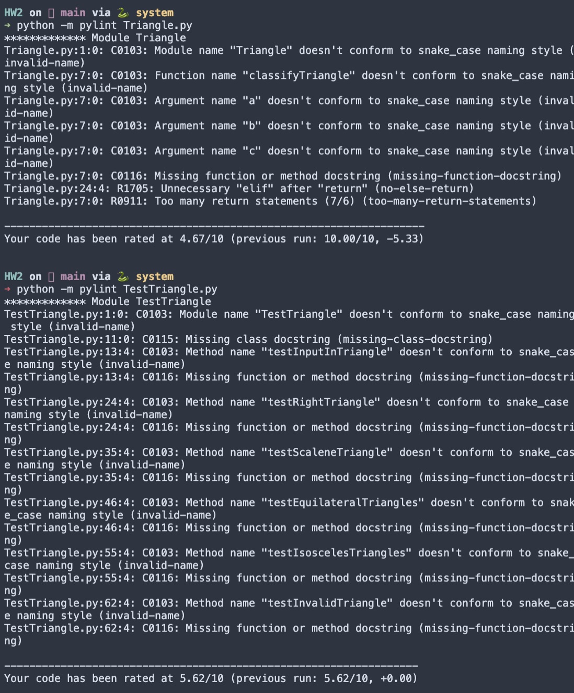

# Static Code Analysis

## Author
Jose J. Cruz

## Description
The objective of this assignment is to apply the techniques from the lecture to static testing of your Triangles program. Specifically:
- You will run a static code analyzer on your code, e.g. Pylint, identify and fix any problems reported by the static code analyzer
- You will run a code coverage tool on your code, e.g. Coverage.py, and extend your test cases to demonstrate at least 80% code coverage

In this assignment, you will need to download and install the tools that you will need for static code analysis and code coverage.  You will then run those tools locally on your laptop to get the results. 

Any changes that you make to your programs should be pushed up to GitHub.

## Deliverables
1. The GitHub URL containing the code that was analyzed
2. The name and output of the static code analyzer tool you used
3. The name and output of the code coverage tool you used;
4. Identify both your original test cases and new test cases that you created to achieve at least 80% code coverage.
5. Attach screen shots of the output of the static code analyzer as well as code coverage.  You should show a screen shot of the analysis results both before and after any changes that you make to your programs:
   1. Static code analysis report on original program
   2. Code coverage report before any changes to the program
   3. Static code analysis report after you have made changes to eliminate issues
   4. Code coverage after any changes to the programs (coverage should be > 80%)

## The name and output of the static code analyzer tool you used
I use [Pylint](https://pylint.org/)

### Output
Before

After 

## The name and output of the code coverage tool you used
I use [Coverage.py](https://coverage.readthedocs.io/en/6.0/). 

_In my defense the code already had 100% coverage before the assigment you can validate with the previous [homework](https://github.com/jjzcru/Triangle567/blob/main/TestTriangle.py)._

### Output
Before

After

